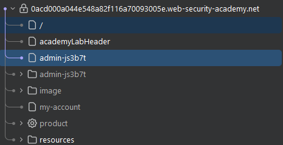

# Access Control - Unprotected Admin Functionality

## Overview

**Lab:** Unprotected admin functionality  
**Platform:** PortSwigger Web Security Academy  
**Difficulty:** APPRENTICE  
**Category:** Access Control

## Objective

This lab has an unprotected admin panel.

To solve the lab, delete the user carlos.

## Reconnaissance

### Initial Analysis

The application contains an admin panel that should be protected but is accessible without proper authentication or authorization checks.

### Target Endpoint

```
https://0a6900ba0497f41c839b05b8005c007a.web-security-academy.net/
```

## Exploitation

### Step 1: Check robots.txt

I accessed the `robots.txt` file to discover hidden or sensitive paths that might not be linked in the main application interface.

**robots.txt content:**

```
User-agent: *
Disallow: /administrator-panel
```

The `robots.txt` file revealed that the `/administrator-panel` path exists and is disallowed for web crawlers, but this does not prevent direct access by users.

### Step 2: Access the Admin Panel

I navigated directly to the administrator panel URL:

**Admin Panel URL:**

```
https://0a6900ba0497f41c839b05b8005c007a.web-security-academy.net/administrator-panel
```

The admin panel was accessible without any authentication or authorization checks, confirming the unprotected functionality vulnerability.

### Step 3: Delete User Carlos

Once inside the admin panel, I could see the list of users. I deleted the user `carlos` to complete the lab objective.

## ✅ Solution

### Exploit Steps

1. Access `robots.txt` to discover hidden paths
2. Navigate to `/administrator-panel` directly
3. Delete the user `carlos` from the admin interface

### Verification

After deleting the user `carlos` from the unprotected admin panel, the lab was successfully completed. This demonstrates that the application failed to implement proper access controls, allowing unauthorized users to access administrative functionality.

## Screenshots



## Key Takeaways

- `robots.txt` files can inadvertently reveal sensitive paths and should not be relied upon for security
- Administrative functionality must be protected with proper authentication and authorization checks
- Unprotected admin panels are a common access control vulnerability that can lead to vertical privilege escalation
- Direct URL access can bypass UI restrictions if server-side access controls are not implemented

## References

- [PortSwigger - Access Control](https://portswigger.net/web-security/access-control)
