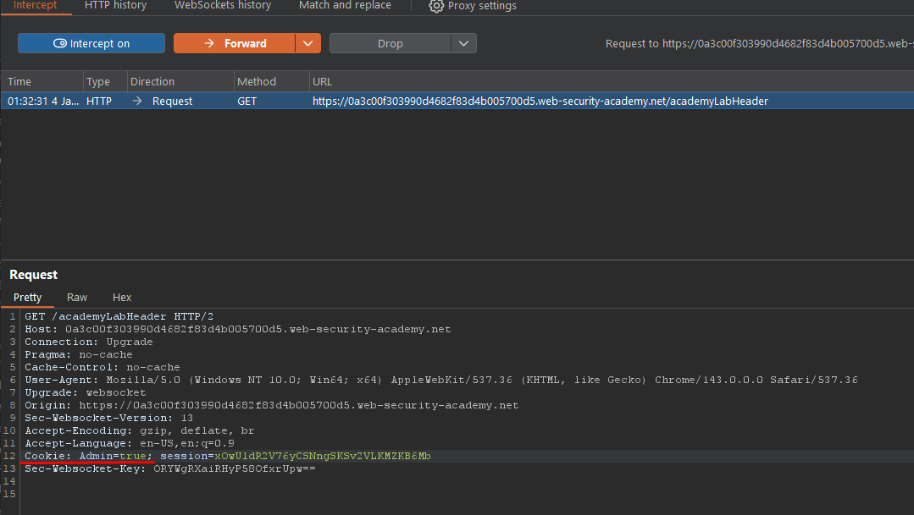

# Access Control - User Role Controlled by Request Parameter

## Overview

**Lab:** User role controlled by request parameter  
**Platform:** PortSwigger Web Security Academy  
**Difficulty:** APPRENTICE  
**Category:** Access Control

## Objective

This lab has an admin panel at `/admin`, which identifies administrators using a forgeable cookie.

To solve the lab, access the admin panel and use it to delete the user carlos.

**Credentials:** `wiener:peter`

## Reconnaissance

### Initial Analysis

The application uses a cookie parameter (`Admin`) to determine user roles. This is a critical vulnerability because cookies can be easily modified by users, allowing privilege escalation.

### Target Endpoint

```
https://0a3c00f303990d4682f83d4b005700d5.web-security-academy.net/
```

## Exploitation

### Step 1: Initial Attempt - Modify Cookie During Login

I intercepted the login request with Burp Suite and observed that the application was sending `Admin=false` in the cookie. I attempted to modify this to `Admin=true` during the login process.

However, this approach failed because the application returned an "Invalid CSRF token" error. CSRF tokens in PortSwigger Web Security Academy are typically single-use or become invalidated immediately after a successful login.

### Step 2: Login Normally

I logged in normally using the provided credentials (`wiener:peter`) to obtain a valid session and CSRF token.

### Step 3: Modify Cookie After Login

After successfully logging in, I intercepted the request to `/my-account` and modified the `Admin` cookie from `false` to `true`:

**Modified Cookie:**

```
Admin=true; session=xOwU1dR2V76yCSNngSKSv2VLKMZKB6Mb
```

This allowed me to access the admin panel at `/admin`.

### Step 4: Maintain Admin Privileges and Delete User

Once inside the admin panel, I could see the list of users. To delete the user `carlos`, I intercepted all subsequent requests and maintained the `Admin=true` cookie in each request. This ensured I retained administrative privileges throughout the deletion process.

## ✅ Solution

### Exploit Steps

1. Log in normally with credentials `wiener:peter` to obtain a valid session
2. Intercept the request to `/my-account` using Burp Suite
3. Modify the `Admin` cookie from `false` to `true`
4. Access the admin panel at `/admin`
5. Intercept all subsequent requests and maintain `Admin=true` in each request
6. Delete the user `carlos` from the admin interface

### Verification

After modifying the `Admin` cookie and maintaining it throughout all requests, I successfully accessed the admin panel and deleted the user `carlos`, completing the lab objective. This demonstrates that user-controllable parameters (like cookies) should never be trusted for access control decisions.

## 📸 Screenshots



## Key Takeaways

- User-controllable parameters (cookies, headers, query parameters) should never be used for access control decisions
- Access control must be enforced server-side and based on authenticated session data, not client-supplied values
- CSRF tokens can prevent some attacks but don't protect against parameter-based access control vulnerabilities
- All requests must be validated - maintaining admin privileges requires keeping the modified cookie in every request
- Parameter-based access control is a critical vulnerability that allows vertical privilege escalation

## References

- [PortSwigger - Access Control](https://portswigger.net/web-security/access-control)
