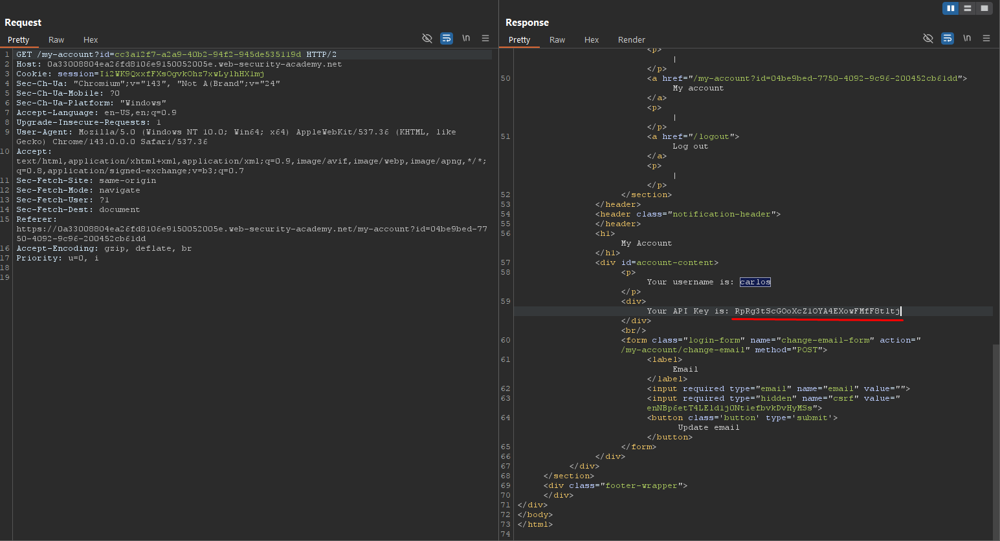

# Access Control - User ID Controlled by Request Parameter with Unpredictable User IDs

## Overview

**Lab:** User ID controlled by request parameter, with unpredictable user IDs  
**Platform:** PortSwigger Web Security Academy  
**Difficulty:** APPRENTICE  
**Category:** Access Control

## Objective

This lab has a horizontal privilege escalation vulnerability on the user account page, but identifies users with GUIDs.

To solve the lab, find the GUID for carlos, then submit his API key as the solution.

**Credentials:** `wiener:peter`

## Reconnaissance

### Initial Analysis

The application uses GUIDs (Globally Unique Identifiers) to identify users, making user IDs unpredictable. However, the `/my-account` endpoint accepts a user ID parameter and returns sensitive information (including API keys) without proper authorization checks, creating a horizontal privilege escalation vulnerability.

### Target Endpoint

```
https://0a33008804ea26fd8106e9150052005e.web-security-academy.net/
```

## Exploitation

### Step 1: Discover the Vulnerability

I logged in with the provided credentials (`wiener:peter`) and accessed the `/my-account` page. I noticed that the endpoint accepts an `id` parameter in the query string. When I passed my own user ID, the application returned my API key.

**Request:**

```
GET /my-account?id=<my-user-id>
```

**Response:**
The response contained my API key, confirming that the endpoint discloses sensitive information based on a user-controllable parameter.

### Step 2: Find Carlos's GUID

Since user IDs are GUIDs and unpredictable, I needed to find carlos's GUID through other means. I explored the application and found a blog section. When viewing blog posts, I noticed that posts are associated with users via a `userId` parameter in the URL.

I found a blog post authored by carlos, and the URL contained his GUID:

**Blog Post URL:**

```
https://0a33008804ea26fd8106e9150052005e.web-security-academy.net/blogs?userId=cc3a12f7-a2a9-40b2-94f2-945de535119d
```

**Carlos's GUID:** `cc3a12f7-a2a9-40b2-94f2-945de535119d`

### Step 3: Access Carlos's Account Information

Using Burp Suite, I intercepted a request to `/my-account` and modified it to include carlos's GUID as the `id` parameter:

**Exploit Request:**

```
GET /my-account?id=cc3a12f7-a2a9-40b2-94f2-945de535119d
```

**Response:**
The application returned carlos's account information, including his API key: `RpRg3tScGOoXcZ1OYA4EXowFMfF8tltj`

## ✅ Solution

### Exploit Steps

1. Log in with credentials `wiener:peter`
2. Discover that `/my-account` accepts an `id` parameter and returns API keys
3. Browse the blog section to find a post by carlos
4. Extract carlos's GUID from the blog post URL (`userId` parameter)
5. Make a GET request to `/my-account?id=cc3a12f7-a2a9-40b2-94f2-945de535119d`
6. Extract carlos's API key from the response
7. Submit the API key as the solution

### Verification

After obtaining carlos's GUID from the blog post and using it to access his account information, I successfully retrieved his API key (`RpRg3tScGOoXcZ1OYA4EXowFMfF8tltj`) and completed the lab objective. This demonstrates that even when user identifiers are unpredictable (GUIDs), horizontal privilege escalation is still possible if the application doesn't properly verify authorization.

## 📸 Screenshots



## Key Takeaways

- Unpredictable user IDs (like GUIDs) don't prevent horizontal privilege escalation if authorization checks are missing
- User-controllable parameters should never be trusted for access control decisions
- Sensitive information (like API keys) should only be accessible to the authenticated user, not other users
- Applications must verify that the authenticated user has permission to access the requested resource
- Information disclosure in other parts of the application (like blog posts) can help attackers discover user identifiers
- Horizontal privilege escalation allows users to access data belonging to other users at the same privilege level

## References

- [PortSwigger - Access Control](https://portswigger.net/web-security/access-control)
