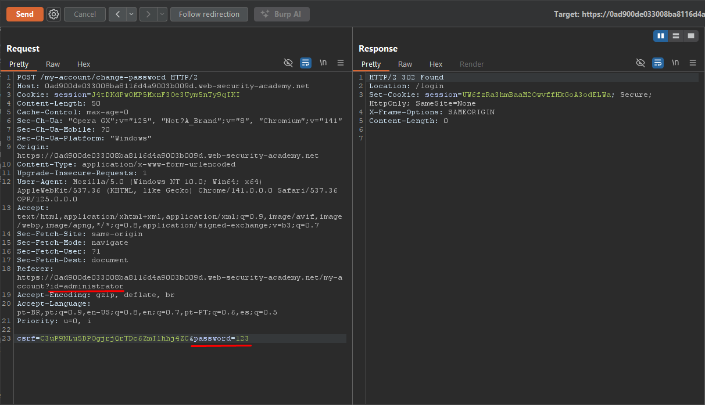
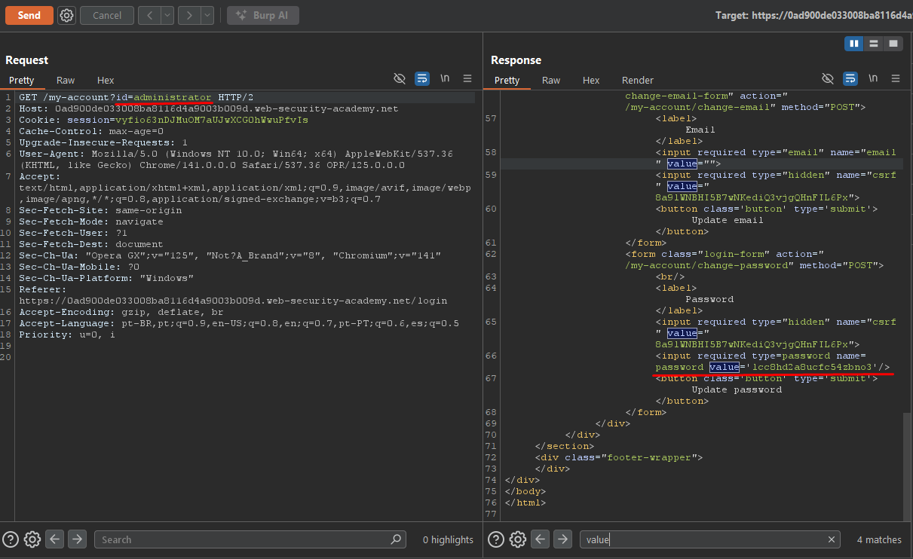

# Access Control - User ID Controlled by Request Parameter with Password Disclosure

## Overview

**Lab:** User ID controlled by request parameter with password disclosure  
**Platform:** PortSwigger Web Security Academy  
**Difficulty:** APPRENTICE  
**Category:** Access Control

## Objective

This lab has a user account page that contains the current user's existing password, prefilled in a masked input.

To solve the lab, retrieve the administrator's password, then use it to delete the user carlos.

**Credentials:** `wiener:peter`

## Reconnaissance

### Initial Analysis

The application's `/my-account` endpoint accepts a user ID parameter and displays account information, including a password change form. The password field is prefilled with the current user's password, which is visible in the HTML source code despite being a masked input field.

### Target Endpoint

```
https://0a8600ec0397a6ad8127c59a00a8003b.web-security-academy.net/
```

## Exploitation

### Step 1: Discover Password Disclosure Vulnerability

I logged in with the provided credentials (`wiener:peter`) and accessed the `/my-account` page. I noticed that when making a GET request to `/my-account?id=wiener`, the response HTML contained a password change form with the current password prefilled in the input field.

**Request:**

```
GET /my-account?id=wiener
```

**Response Analysis:**
The HTML response contained a password input field with the current password visible in the `value` attribute:

```html
<input required type="password" name="password" value="<current-password>" />
```

Even though the input type is `password` (which masks the value in the browser), the actual password value is exposed in the HTML source code.

### Step 2: Initial Attempt - Password Change

I attempted to change the administrator's password by making a POST request to `/my-account/change-password` with `id=administrator` in the Referer header and setting a new password (`password=123`). However, this approach did not work because the password change endpoint validates authorization based on the authenticated session (logged in as `wiener`), not on the `id` parameter in the Referer header.

### Step 3: Access Administrator's Account Page

I modified the request to access the administrator's account page directly:

**Exploit Request:**

```
GET /my-account?id=administrator
```

**Response:**
The application returned the administrator's account page HTML, which included the password change form with the administrator's current password visible in the source code:

```html
<input required type="password" name="password" value="lcc8hd2a8ucfc54zbno3" />
```

**Administrator's Password:** `lcc8hd2a8ucfc54zbno3`

### Step 4: Login as Administrator and Delete User

Using the discovered credentials, I logged in as the administrator:

**Credentials:**

- Username: `administrator`
- Password: `lcc8hd2a8ucfc54zbno3`

After successfully logging in, I gained access to the admin panel and deleted the user `carlos` to complete the lab objective.

## ✅ Solution

### Exploit Steps

1. Log in with credentials `wiener:peter`
2. Make a GET request to `/my-account?id=wiener` and observe password disclosure in HTML source
3. Make a GET request to `/my-account?id=administrator` to access administrator's account page
4. Extract the administrator's password from the HTML source code (`value` attribute in password input field)
5. Log in with administrator credentials (`administrator:lcc8hd2a8ucfc54zbno3`)
6. Access the admin panel and delete the user `carlos`

### Verification

After discovering the password disclosure vulnerability and extracting the administrator's password from the HTML source code, I successfully logged in as the administrator and deleted the user `carlos`, completing the lab objective. This demonstrates a critical information disclosure vulnerability combined with horizontal privilege escalation, leading to vertical privilege escalation.

## Screenshots





## Key Takeaways

- Passwords should never be prefilled in HTML forms, even in masked input fields
- The `value` attribute in password fields exposes credentials in the HTML source code, regardless of the `type=password` attribute
- User-controllable parameters (`id`) should not allow access to other users' account information
- Information disclosure vulnerabilities can lead to horizontal and vertical privilege escalation
- Applications must verify authorization before displaying sensitive information like passwords
- HTML source code inspection is a critical step in security testing
- This vulnerability combines horizontal privilege escalation (accessing administrator's account) with information disclosure (password in HTML) to achieve vertical privilege escalation

## References

- [PortSwigger - Access Control](https://portswigger.net/web-security/access-control)
