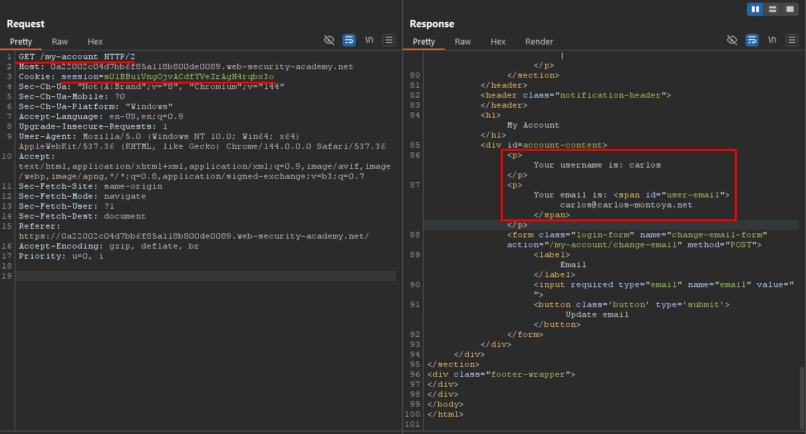

# Authentication - 2FA Simple Bypass

## Overview

**Lab:** 2FA simple bypass  
**Platform:** PortSwigger Web Security Academy  
**Difficulty:** APPRENTICE  
**Category:** Authentication

## Objective

This lab's two-factor authentication can be bypassed. You have already obtained a valid username and password, but do not have access to the user's 2FA verification code.

To solve the lab, access Carlos's account page.

**Provided Credentials:**
- Test account: `wiener:peter`
- Victim account: `carlos:montoya`

## Reconnaissance

### Initial Analysis

The application implements a two-factor authentication (2FA) system that requires users to enter their password first, then a verification code sent via email. However, the implementation is flawed and allows bypassing the second authentication step.

### Target Endpoint

```
https://0a22002c04d7bb6f85a118b800de0089.web-security-academy.net/
```

## Exploitation

### Step 1: Understanding the Authentication Flow

I first tested the application with the provided test credentials `wiener:peter` to understand the authentication flow:

1. After entering valid credentials, the application sends an MFA code to the user's email
2. The application provides a button to view the email, where the MFA code can be retrieved
3. Entering the MFA code completes the authentication process

### Step 2: Analyzing the Authentication Mechanism

By intercepting the requests with Burp Suite, I discovered the authentication flow:

- **POST `/login`**: When valid credentials are provided, the application returns a session token in the response
- **POST `/login2`**: This endpoint is called when submitting the MFA code (e.g., `mfa-code=0548`)

The session token is issued immediately after the first authentication step (password validation), before the MFA verification is completed.

### Step 3: Identifying the Vulnerability

The critical vulnerability is that the session token is created and validated after the first authentication step, but the application doesn't properly verify that the second step (MFA) has been completed before allowing access to protected resources.

### Step 4: Bypassing 2FA

I logged in with the victim's credentials `carlos:montoya`:

1. After submitting valid credentials, I received a session token: `session=BQ2ll9EsFBtDFJpKLAWQoimcaO6JyGZ8`
2. Without completing the MFA step (since I don't have access to Carlos's email), I attempted to access the protected `/my-account` endpoint directly using the session token

**Request:**

```
GET /my-account HTTP/2
Host: 0a22002c04d7bb6f85a118b800de0089.web-security-academy.net
Cookie: session=s01BBuiVngOjvACdfYVeZrAgH4rqbx3o
...
```

### Step 5: Successful Bypass

The request to `/my-account` was successful, allowing me to access Carlos's account page and view sensitive information, including his email address, without completing the 2FA verification step.

## ✅ Solution

### Exploit Steps

1. Log in with victim credentials (`carlos:montoya`)
2. Capture the session token from the response after password authentication
3. Use the session token to directly access protected endpoints (e.g., `/my-account`) without completing MFA verification

### Verification

By accessing `/my-account` with the session token obtained after the first authentication step, I successfully bypassed the 2FA requirement and accessed Carlos's account page, completing the lab objective.

This demonstrates that the application creates an authenticated session state before verifying the second authentication factor, allowing attackers to bypass 2FA by directly accessing protected resources with the session token.

## Screenshots



## Key Takeaways

- Two-factor authentication implementations must verify both factors before granting access to protected resources
- Session tokens should only be issued after complete authentication (including 2FA verification)
- Applications should check 2FA completion status on every protected endpoint, not just during the initial authentication flow
- The authentication state should be properly managed to prevent bypassing multi-factor authentication
- Security controls must be enforced server-side and cannot rely solely on client-side validation

## References

- [PortSwigger - Authentication](https://portswigger.net/web-security/authentication)
- [PortSwigger - Multi-factor authentication](https://portswigger.net/web-security/authentication/multi-factor)
