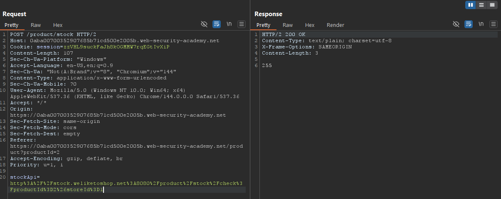
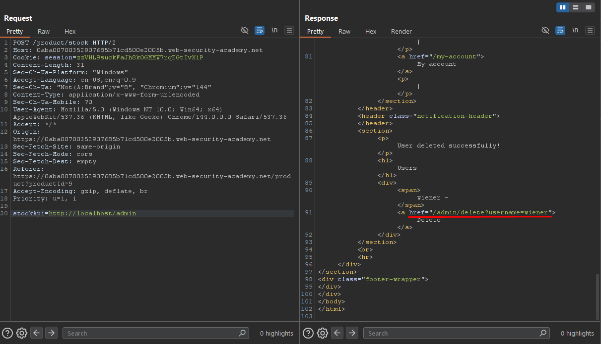

# SSRF - Basic SSRF against the Local Server

## Overview

**Lab:** Basic SSRF against the local server  
**Platform:** PortSwigger Web Security Academy  
**Difficulty:** APPRENTICE  
**Category:** Server-Side Request Forgery (SSRF)

## Objective

This lab has a stock check feature which fetches data from an internal system.

To solve the lab, change the stock check URL to access the admin interface at `http://localhost/admin` and delete the user carlos.

## Reconnaissance

### Initial Analysis

The application contains a stock check feature that allows users to check product availability. This feature makes server-side requests to fetch stock information from an internal system.

### Target Endpoint

```
https://0aba00700352907685b71cd500e2005b.web-security-academy.net/
```

### Testing Direct Access

I first attempted to access the admin interface directly at `http://localhost/admin`, but received an error indicating that authentication and admin permissions are required. This suggests that the admin interface exists but is protected by access controls.

## Exploitation

### Step 1: Identifying the Stock Check Feature

While exploring the application, I discovered that products are displayed on the site, and each product has a stock check functionality. When checking the stock of a product, I intercepted the request and analyzed it.

**Original Request:**

```
POST /product/stock HTTP/2
Host: 0aba00700352907685b71cd500e2005b.web-security-academy.net
Content-Type: application/x-www-form-urlencoded
...

stockApi=http%3A%2F%2Fstock.weliketoshop.net%3A8080%2Fproduct%2Fstock%2Fcheck%3FproductId%3D2%26storeId%3D1
```

The `stockApi` parameter contains a URL-encoded value pointing to `http://stock.weliketoshop.net:8080/product/stock/check?productId=2&storeId=1`. This indicates that the server is making HTTP requests based on user-controlled input, which is a potential SSRF vulnerability.

### Step 2: Testing SSRF Vulnerability

I modified the `stockApi` parameter to test if the server would make requests to internal endpoints. I changed the URL to point to the local admin interface:

**Modified Request:**

```
stockApi=http://localhost/admin
```

The server successfully fetched the contents of the admin interface and returned it in the response. This confirmed that the application is vulnerable to SSRF attacks against the local server.

### Step 3: Accessing the Admin Interface

In the response, I could see the admin interface HTML, which included links to delete users. The response contained links like:

```html
<a href="/admin/delete?username=carlos">
```

This showed that users `carlos` and `wiener` exist in the system, and the admin interface provides functionality to delete users.

### Step 4: Deleting the User Carlos

Using the SSRF vulnerability, I modified the `stockApi` parameter to directly call the delete endpoint:

**Final Exploit Request:**

```
POST /product/stock HTTP/2
Host: 0aba00700352907685b71cd500e2005b.web-security-academy.net
Cookie: session=zzVHL9suckFaJh8kOGMMW7rqEGtIvXiP
Content-Type: application/x-www-form-urlencoded
...

stockApi=http://localhost/admin/delete?username=carlos
```

The server made a request to `http://localhost/admin/delete?username=carlos` from the local machine, bypassing the access controls that would normally prevent unauthorized access. The user `carlos` was successfully deleted.

## ✅ Solution

### Exploit Steps

1. Identify the stock check feature that accepts a `stockApi` parameter
2. Modify the `stockApi` parameter to point to `http://localhost/admin` to access the admin interface
3. Use the SSRF vulnerability to call the delete endpoint: `http://localhost/admin/delete?username=carlos`

### Final Payload

```
stockApi=http://localhost/admin/delete?username=carlos
```

### Verification

By exploiting the SSRF vulnerability, I successfully bypassed the access controls and deleted the user `carlos` from the admin interface. The request originated from the local machine, so the application treated it as a trusted request and granted administrative access.

This demonstrates that the application trusts requests originating from `localhost`, allowing SSRF attacks to bypass authentication and authorization controls.

## Screenshots





## Key Takeaways

- SSRF vulnerabilities occur when applications make server-side requests based on user-controlled input without proper validation
- Applications that trust requests from `localhost` can be vulnerable to SSRF attacks that bypass access controls
- The `stockApi` parameter should be validated to only allow requests to whitelisted domains
- Server-side requests should be restricted to prevent access to internal services and administrative interfaces
- Access controls should not rely solely on the source IP address or hostname, as SSRF can make requests appear to come from trusted locations

## References

- [PortSwigger - SSRF](https://portswigger.net/web-security/ssrf)
- [PortSwigger - SSRF against the server](https://portswigger.net/web-security/ssrf#ssrf-attacks-against-the-server)
